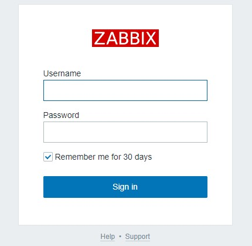

# Gerenciamento de Redes com Zabbix

[in progress: Descrição do Zabbix]

## Instalação do Zabbix via Docker

Faça o download do repositório:
```bash
git clone https://github.com/WilliamJSS/zabbix.git
```

Suba o container com a stack do **zabbix** (mysql, zabbix-server, zabbix-frontend, zabbix-agent, grafana, cadvisor e redis):
```bash
sudo service docker start
```
```bash
docker compose up -d
```

## Configuração do Zabbix Frontend

No navegador, insira o ip da sua máquina, seguido da porta onde está rodando o zabbix-frontend - vai ser algo parecido com `172.0.0.1:8010` - (o padrão é a 8010, mas você pode alterar isso no **docker-compose.yml**). Para verificar o ip da máquina, você pode verificar atráves do comando `ip addr`.



Para acessar o zabbix-frontend, entre com o usuário **Admin** e senha **zabbix**.

Assim que logar no sistema, uma mensagem de erro vai aparecer para o **Zabbix server**, para corrigir basta ir nas configurações do mesmo e alterar o endereço de ip do agent. Para saber qual o ip correto, insira o seguinte comando no terminal:

```bash
docker network inspect zabbix_zabbix
```

Copie o endereço de ip exibido para o container do **zabbix-agent** e cole no sistema. Com isso, basta aguardar alguns minutos que o ip será atualizado.

## Adicionando um **Zabbix Agent** em outro Host

[in progress]

## Adicionando um novo Host no **Zabbix Frontend**

[in progress]

## Referências :mag_right:

* [Como instalar e configurar o Zabbix para monitorar servidores remotos com segurança no Ubuntu 20.04](https://www.digitalocean.com/community/tutorials/how-to-install-and-configure-zabbix-to-securely-monitor-remote-servers-on-ubuntu-20-04-pt)
* [Instalação do Zabbix com Docker-Compose](https://www.youtube.com/watch?v=0c2k2hZMeCE)
* [stack-zabbix-grafana-prometheus](https://github.com/joaovitorit/stack-zabbix-grafana-prometheus)
